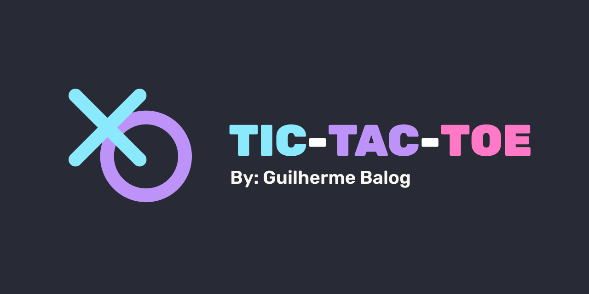

# Tic Tac Toe

My implementation of Tic Tac Toe, using Javascript

# Sobre

Durante um bom tempo tive a visão de que ser um bom programador significava saber fazer tudo do zero, fazer implementações sem bibliotecas ou frameworks, etc. Aos poucos minha visão foi mudando e hoje me sinto totalmente confortável em pedir ajuda, assistir tutoriais, ver perguntas no Stack Overflow, entre outros. E uma das primeiras vezes que me permiti seguir tutoriais foi quando implementei o Jogo da Velha (Tic Tac Toe). 

Me baseei em dois vídeos: [um do Código Fonte TV](https://www.youtube.com/watch?v=M258B1b_pMs), com javascript puro, e [outro do Coding Train](https://www.youtube.com/watch?v=GTWrWM1UsnA), utilizando a biblioteca p5.js. A estrutura do código é bem parecida com o primeiro vídeo, mas alguns detalhes de implementação são inspirados pelo segundo vídeo.

Além do javascript, foi uma boa oportunidade para treinar responsividade com flex-box no css e também hospedagem no github pages, o que abriu minha cabeça para novas possibilidades de projetos.

O jogo pode ser jogado acessando https://guilhermebalog.github.io/tic-tac-toe/.

**Tópicos:**

- HTML5
- Responsividade
- CSS Grid
- Flex-box
- Objetos javascript
- Manipulação da DOM
  